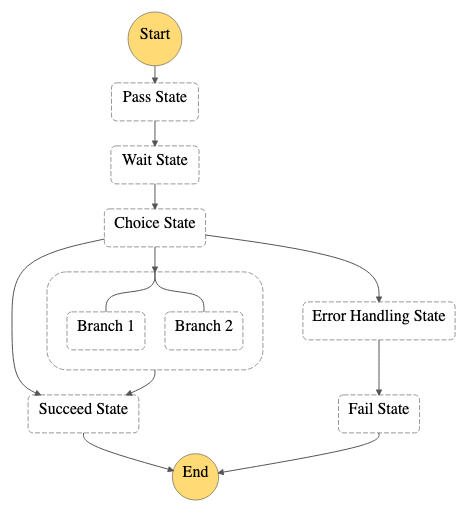

# Invoke an AWS Step Functions workflow from AWS Lambda, with logging enabled

The Terraform template deploys a Lambda function, and a Step Functions workflow, a Log group and the IAM resources required to run the application. A Lambda function uses the AWS SDK to asyncronously invoke the Step Function workflow, passing the event body. The Express Workflow results are logged in Amazon CloudWatch Logs. The Lambda function returns the response from the Step Function including the execution ARN and start date.

Learn more about this pattern at Serverless Land Patterns: https://serverlessland.com/patterns/lambda-sfn-terraform.

Important: this application uses various AWS services and there are costs associated with these services after the Free Tier usage - please see the [AWS Pricing page](https://aws.amazon.com/pricing/) for details. You are responsible for any AWS costs incurred. No warranty is implied in this example.

## Requirements

* [Create an AWS account](https://portal.aws.amazon.com/gp/aws/developer/registration/index.html) if you do not already have one and log in. The IAM user that you use must have sufficient permissions to make necessary AWS service calls and manage AWS resources.
* [AWS CLI](https://docs.aws.amazon.com/cli/latest/userguide/install-cliv2.html) installed and configured
* [Git Installed](https://git-scm.com/book/en/v2/Getting-Started-Installing-Git)
* [Terraform](https://learn.hashicorp.com/tutorials/terraform/install-cli?in=terraform/aws-get-started) installed

## Deployment Instructions

1. Create a new directory, navigate to that directory in a terminal and clone the GitHub repository:
    ``` 
    git clone https://github.com/aws-samples/serverless-patterns
    ```
1. Change directory to the pattern directory:
    ```
    cd serverless-patterns/lambda-sfn-terraform
    ```
1. From the command line, initialize terraform to  to downloads and installs the providers defined in the configuration:
    ```
    terraform init
    ```
1. From the command line, apply the configuration in the main.tf file:
    ```
    terraform apply
    ```
1. During the prompts:
    * Enter yes
1. Note the outputs from the deployment process. These contain the resource names and/or ARNs which are used for testing.

## How it works

The template creates a Step Function showcasing the different States, with a CloudWatch log group for log reporting of all events.



## Testing

1. Run the following Lambda CLI invoke commands to invoke the function with multiple inputs. Replace the <LambdaName> with the Lambda function name of the deployed Lambda function. This is provided in the terraform outputs.
    ```bash
    aws lambda invoke --function-name {LambdaProxyArn} --payload '{ "Choice": "A" }' responseA.json
    aws lambda invoke --function-name {LambdaProxyArn} --payload '{ "Choice": "B" }' responseA.json
    aws lambda invoke --function-name {LambdaProxyArn} --payload '{ "Choice": "C" }' responseA.json
    ```
1. Go to the Step Function Console and view the different invocations to note the different behavior with the different inputs

## Cleanup
1. Change directory to the pattern directory:
    ```
    cd serverless-patterns/lambda-sfn-terraform
    ```
1. Delete all created resources
    ```bash
    terraform destroy
    ```
1. During the prompts:
    * Enter yes
1. Confirm all created resources has been deleted
    ```bash
    terraform show
    ```
----
Copyright 2022 Amazon.com, Inc. or its affiliates. All Rights Reserved.

SPDX-License-Identifier: MIT-0
