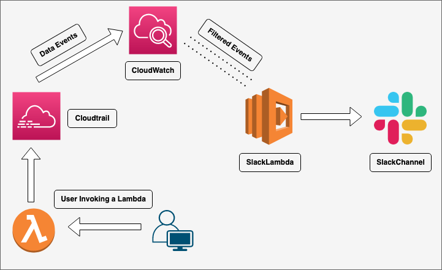

# AWS Lambda and Cloudtrail data events



This pattern demonstrates how customers can monitor manual invocations of their sensitive lambda functions through slack with the help of Cloudtrail and Cloudwatch Subscription filter.

Learn more about this pattern at Serverless Land Patterns: https://serverlessland.com/patterns/terraform-cloudtrail-lambda-slack

Important: this application uses various AWS services and there are costs associated with these services after the Free Tier usage - please see the [AWS Pricing page](https://aws.amazon.com/pricing/) for details. You are responsible for any AWS costs incurred. No warranty is implied in this example.

## Requirements

* [Create an AWS account](https://portal.aws.amazon.com/gp/aws/developer/registration/index.html) if you do not already have one and log in. The IAM user that you use must have sufficient permissions to make necessary AWS service calls and manage AWS resources.
* [AWS CLI](https://docs.aws.amazon.com/cli/latest/userguide/install-cliv2.html) installed and configured
* [Git Installed](https://git-scm.com/book/en/v2/Getting-Started-Installing-Git)
* [Terraform](https://learn.hashicorp.com/tutorials/terraform/install-cli?in=terraform/aws-get-started) installed

## Getting started with Terraform Serverless Patterns
Read more about general requirements and deployment instructions for Terraform Serverless Patterns [here](https://github.com/aws-samples/serverless-patterns/blob/main/terraform-fixtures/docs/README.md). 


## Deployment Instructions

1. Create a new directory, navigate to that directory in a terminal and clone the GitHub repository:
    ``` 
    git clone https://github.com/aws-samples/serverless-patterns
    ```
1. Change directory to the pattern directory:
    ```
    cd serverless-patterns/terraform-cloudtrail-lambda-slack
    ```
1. From the command line, initialize terraform to  to downloads and installs the providers defined in the configuration:
    ```
    terraform init
    ```
1. From the command line, apply the configuration in the main.tf file:
    ```
    terraform apply
    ```
1. During the prompts:
    * Enter the function ARNS to monitor in the form of a list
    ```
    ["Lambda1","Lambda2"]
    ```
    * Enter your slack channel url
    * Enter a unique S3 bucketname (for Cloudtrail)

1. Note the outputs from the deployment process. These contain the resource names and/or ARNs which are used for testing.

## How it works

This pattern creates an AWS Cloudtrail for capturing data events of your lambda function to be monitored and the events will be pushed to Cloudwatch logs. It will also create a Lambda function which will have the code to push Slack notifications for the events fetched from the Cloudwatch using subscription filter to fetch only IAM user events.


## Testing

Open the lambda function which you added to monitor and manually test invoke it. After 5 minutes you should see the message in your slack channel showing the user invocation.

#sample message:
```
User 'arn:aws:iam::<account-id>:user/RogueUser' performed Invoke on function 'arn:aws:lambda:us-east-1:<account-id>:function:testfunction' at 2023-03-27T13:04:09Z
```

## Cleanup
 
1. Change directory to the pattern directory:
    ```
    cd serverless-patterns/terraform-cloudtrail-lambda-slack
    ```
1. Delete all created resources
    ```bash
    terraform destroy
    ```
1. During the prompts:
    * Enter the function ARNS to monitor in the form of a list
    ```
    ["Lambda1","Lambda2"]
    ```
    * Enter your slack channel url
    * Enter a unique S3 bucketname (for Cloudtrail)
1. Confirm all created resources has been deleted
    ```bash
    terraform show
    ```
----
Copyright 2022 Amazon.com, Inc. or its affiliates. All Rights Reserved.

SPDX-License-Identifier: MIT-0

